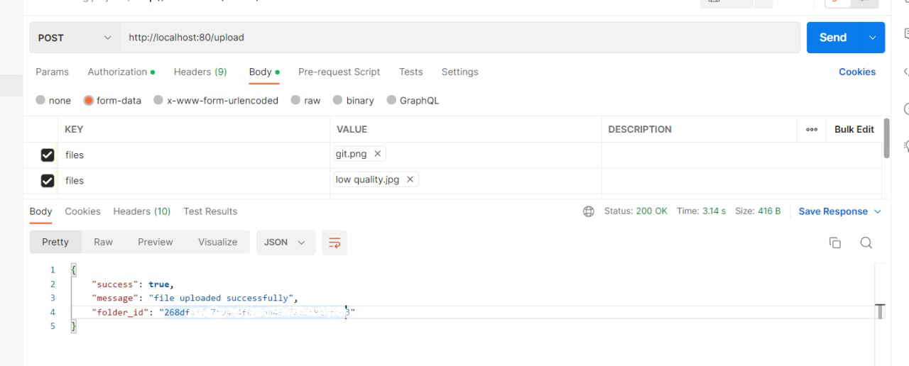
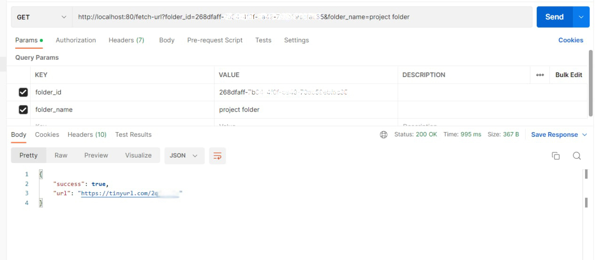

# ClicknShare

**Problem Statement:** Need to share a file with someone but cannot or doesn't want to use google drive, whatsapp, telegram, discord etc. Well you maybe wandering why I would not want to use any of these services🤔. So, let me tell u a scenario - I have encountered this problem myself when I was working on some project in my college lab but didn't able to complete in there so thought of sharing the project files so that I could continue from where I left off once I reach home. But I was not on my personal computer and I don't wanna login to my google, whatsapp or any account on my college devices. So, how can I share those files? Hmm... don't know?  
This is just one scenario but it could happen somewhere else as well. Now, thinking about the solution - what if there is some sort of website where I could just upload multiple files, could get a link and later on, when I hit on that link, all those files gets downloaded on my device. Something similar to a codebin but building out something like this had some problems -  
**what about the storage?**  
**where can I store all these files uploaded by multiple users?**  
**How can I build something like this?** 

**My approach:** While learning about REST APIs, I figured out some solution for this problem and i.e. **ClicknShare** which acts a service provider and can be used by its clients to upload multiple files inside a folder and get a download link which can be used to download a zip folder with the same name as provided and that link will only be active for 24 hours🤗. But It's not live yet since for that I need to have some personalised server😞. For now, let us just go through the APIs, I have built and understand how can we use them to share our files.

## Wanna Contribute to Project 
1. Fork this repository
2. Set up a new virtual environment
3. Clone the forked repository
4. Add forked repo as origin and this one as the upstream
5. Change into the project directory and install the project dependency by running `pip install -r requirements.txt`
6. Run the project locally by `python manage.py runserver`.

## How to use APIs
There are two APIs built into this project requiring basic authentication, let us understand how to use each one of them - 

### 1. To upload files -

**EndPoint**
`/upload`

**Request Type**
`POST`

**Authorization**
`Basic dXNlcm5hbWU6cGFzc3dvcmQoSW4gYmFzZTY0IGZvcm1hdCk=`

**Request Media Format Supported**
`JSON, XML`

**Body**
```sh
  key                         value
--------------------------------------------
 files                    file to upload
```

for multiple files, you can use `files` key multiple times inside the request body as -
```sh
  key                         value
--------------------------------------------
 files                     file to upload
 files                     file to upload
 files                     file to upload
```

**Response Media Format Supported**
`JSON, XML`

**Dummy Response**
```sh
{
    "success": true,
    "message": "file uploaded successfully",
    "folder_id": "c25b5f3a-576d-4cef-8aa6-1030f7458135"
}
Note that you will be needing folder_id when requesting to get the download link so keep it safe somewhere.
```



### 2. Get Download Link -

**EndPoint**
`/fetch-url`

**Request Type**
`GET`

**Authorization**
`Basic dXNlcm5hbWU6cGFzc3dvcmQoSW4gYmFzZTY0IGZvcm1hdCk=`

**Query Parameters**
```sh
folder_id = c25b5f3a-576d-4cef-8aa6-1030f7458135
folder_name (optional) = my personal folder
```

**Response Media Format Supported**
`JSON, XML`

**Dummy Response**
```sh
{
    "success": true,
    "url": "https://tinyurl.com/26utkmsr"
}
The url can be used to download the zip folder containing all the files uploaded earlier.
```

